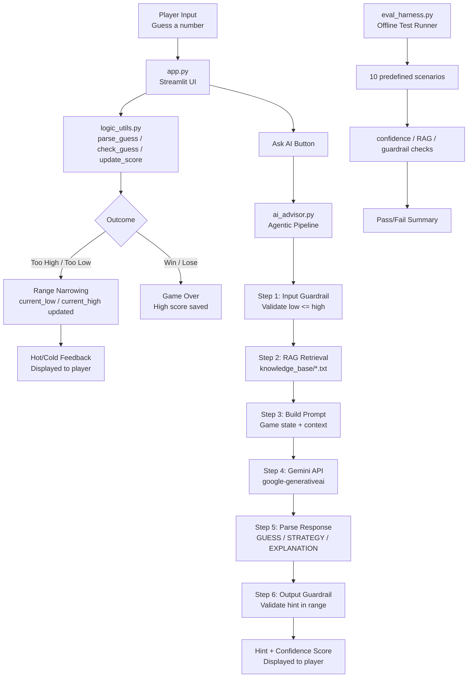

```mermaid
flowchart TD
    A[Player Input\nGuess a number] --> B[app.py\nStreamlit UI]
    B --> C[logic_utils.py\nparse_guess / check_guess / update_score]
    C --> D{Outcome}
    D -->|Too High / Too Low| E[Range Narrowing\ncurrent_low / current_high updated]
    D -->|Win / Lose| F[Game Over\nHigh score saved]
    E --> G[Hot/Cold Feedback\nDisplayed to player]

    B --> H[Ask AI Button]
    H --> I[ai_advisor.py\nAgentic Pipeline]

    I --> J[Step 1: Input Guardrail\nValidate low <= high]
    J --> K[Step 2: RAG Retrieval\nknowledge_base/*.txt]
    K --> L[Step 3: Build Prompt\nGame state + context]
    L --> M[Step 4: Gemini API\ngoogle-generativeai]
    M --> N[Step 5: Parse Response\nGUESS / STRATEGY / EXPLANATION]
    N --> O[Step 6: Output Guardrail\nValidate hint in range]
    O --> P[Hint + Confidence Score\nDisplayed to player]

    Q[eval_harness.py\nOffline Test Runner] --> R[10 predefined scenarios]
    R --> S[confidence / RAG / guardrail checks]
    S --> T[Pass/Fail Summary]
```
